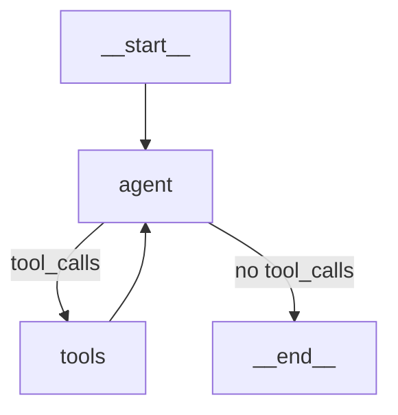

# The Three Building Blocks: Agent Node, ToolNode, and tools_condition

## The ReAct Loop as Three Components

A LangGraph ReAct agent has exactly three essential pieces:

```
┌──────────────────────────────────────────────────────────────┐
│                                                              │
│   START                                                      │
│     │                                                        │
│     ▼                                                        │
│ ┌─────────────┐                        ┌─────────────┐       │
│ │ AGENT NODE  │───── tools_condition ──│  ToolNode   │       │
│ │ (LLM call)  │        (routing)       │ (execution) │       │
│ └─────────────┘                        └─────────────┘       │
│     │                                        │               │
│     │ (no tool calls)                        │               │
│     ▼                                        │               │
│    END ◀─────────────────────────────────────┘               │
│                                                              │
└──────────────────────────────────────────────────────────────┘
```

|Component|Purpose|What It Does|
|---|---|---|
|**Agent Node**|Reasoning|Calls LLM, decides what to do next|
|**tools_condition**|Routing|Checks if LLM wants tools, routes accordingly|
|**ToolNode**|Execution|Runs requested tools, returns results|

---

## Building Block 1: The Agent Node

The agent node is a function that calls the LLM with the current conversation state.

### Basic Agent Node

```python
from langchain_openai import ChatOpenAI
from langgraph.graph import MessagesState

# LLM with tools bound
llm = ChatOpenAI(model="gpt-4o-mini")
tools = [calculator, search, get_time]
llm_with_tools = llm.bind_tools(tools)

def agent_node(state: MessagesState):
    """Call the LLM and return its response."""
    response = llm_with_tools.invoke(state["messages"])
    return {"messages": [response]}
```

### What the Agent Node Returns

The LLM returns an `AIMessage` with either:

**Option A: Tool calls** (needs more info)

```python
AIMessage(
    content="",  # Often empty when tool calling
    tool_calls=[
        {"name": "calculator", "args": {"expression": "230 * 0.15"}, "id": "call_abc123"},
        {"name": "get_time", "args": {}, "id": "call_def456"}
    ]
)
```

**Option B: Final response** (done)

```python
AIMessage(
    content="The result is 34.5 and the current time is 14:30:00.",
    tool_calls=[]  # Empty — no tools needed
)
```

### Agent Node with System Prompt

```python
from langchain_core.messages import SystemMessage

def agent_node(state: MessagesState):
    """Agent with system prompt."""
    system = SystemMessage(content="You are a helpful assistant with access to tools.")
    messages = [system] + state["messages"]
    response = llm_with_tools.invoke(messages)
    return {"messages": [response]}
```

**Note:** The system message is added at call time, not stored in state. This keeps the conversation history clean.

### Anthropic Version

```python
from langchain_anthropic import ChatAnthropic

llm = ChatAnthropic(model="claude-sonnet-4-20250514")
llm_with_tools = llm.bind_tools(tools)

def agent_node(state: MessagesState):
    response = llm_with_tools.invoke(state["messages"])
    return {"messages": [response]}
```

The agent node structure is identical — only the LLM class differs.

---

## Building Block 2: tools_condition

`tools_condition` is a prebuilt function that routes based on whether the last message has tool calls.

### What It Does

```python
from langgraph.prebuilt import tools_condition

# tools_condition checks the last AIMessage:
# - If tool_calls exist → return "tools"
# - If no tool_calls → return END (or "__end__")
```

### Under the Hood

Here's what `tools_condition` does internally:

```python
from langgraph.graph import END

def tools_condition(state):
    """Route based on whether the last message has tool calls."""
    messages = state["messages"]
    last_message = messages[-1]
    
    # Check if the AI wants to use tools
    if hasattr(last_message, "tool_calls") and last_message.tool_calls:
        return "tools"
    
    return END  # Or "__end__"
```

### Using tools_condition

```python
from langgraph.graph import StateGraph, MessagesState, START, END
from langgraph.prebuilt import ToolNode, tools_condition

builder = StateGraph(MessagesState)
builder.add_node("agent", agent_node)
builder.add_node("tools", ToolNode(tools))

builder.add_edge(START, "agent")

# Conditional edge using tools_condition
builder.add_conditional_edges(
    "agent",           # Source node
    tools_condition,   # Routing function
    # Optional: explicit mapping (shown below)
)

builder.add_edge("tools", "agent")  # Loop back
graph = builder.compile()
```

### Custom Routing Mapping

By default, `tools_condition` returns `"tools"` or `END`. You can map these to different node names:

```python
builder.add_conditional_edges(
    "agent",
    tools_condition,
    {
        "tools": "execute_tools",  # Map "tools" to your node name
        END: END,
    }
)
```

### Writing Your Own Condition

If you need custom logic:

```python
def custom_should_continue(state: MessagesState) -> str:
    """Custom routing with additional checks."""
    messages = state["messages"]
    last_message = messages[-1]
    
    # Check for tool calls
    if hasattr(last_message, "tool_calls") and last_message.tool_calls:
        # Optional: limit iterations
        if len(messages) > 20:
            return "too_many_iterations"
        return "tools"
    
    return END

builder.add_conditional_edges(
    "agent",
    custom_should_continue,
    {
        "tools": "tools",
        "too_many_iterations": "summarize",
        END: END
    }
)
```

---

## Building Block 3: ToolNode

`ToolNode` is a prebuilt node that executes tools requested by the LLM.

### Basic Usage

```python
from langgraph.prebuilt import ToolNode
from langchain_core.tools import tool

@tool
def calculator(expression: str) -> str:
    """Evaluate a math expression."""
    return str(eval(expression))

@tool
def get_time() -> str:
    """Get current time."""
    from datetime import datetime
    return datetime.now().strftime("%H:%M:%S")

tools = [calculator, get_time]
tool_node = ToolNode(tools)
```

### What ToolNode Does

When the graph enters `ToolNode`:

1. **Extracts tool calls** from the last `AIMessage`
2. **Executes each tool** (in parallel by default)
3. **Returns `ToolMessage` objects** with results

```python
# Input state (after agent node):
{
    "messages": [
        HumanMessage(content="What's 15% of 230?"),
        AIMessage(content="", tool_calls=[
            {"name": "calculator", "args": {"expression": "230 * 0.15"}, "id": "call_123"}
        ])
    ]
}

# Output from ToolNode:
{
    "messages": [
        ToolMessage(content="34.5", tool_call_id="call_123", name="calculator")
    ]
}
```

### Parallel Execution

If the LLM requests multiple tools, `ToolNode` runs them **in parallel**:

```python
# LLM requests two tools:
AIMessage(tool_calls=[
    {"name": "calculator", "args": {"expression": "230 * 0.15"}, "id": "call_1"},
    {"name": "get_time", "args": {}, "id": "call_2"}
])

# ToolNode executes both concurrently, returns:
{
    "messages": [
        ToolMessage(content="34.5", tool_call_id="call_1", name="calculator"),
        ToolMessage(content="14:30:00", tool_call_id="call_2", name="get_time")
    ]
}
```

This is automatic — you don't need to configure anything.

---

## ToolNode Configuration Options

### Error Handling

**Default behavior (as of LangGraph 1.0.1+):** Errors propagate and crash the graph.

```python
# Default: errors propagate
tool_node = ToolNode(tools)

# Catch all errors, return message to LLM
tool_node = ToolNode(tools, handle_tool_errors=True)

# Custom error message
tool_node = ToolNode(tools, handle_tool_errors="Tool failed. Try a different approach.")

# Custom error handler
def handle_error(e: Exception) -> str:
    return f"Error: {type(e).__name__}: {str(e)}"

tool_node = ToolNode(tools, handle_tool_errors=handle_error)

# Only catch specific exceptions
tool_node = ToolNode(tools, handle_tool_errors=(ValueError, TypeError))
```

**Important:** In production, you almost always want `handle_tool_errors=True` so the LLM can recover.

### Custom Messages Key

If your state uses a different key for messages:

```python
class CustomState(TypedDict):
    conversation: Annotated[list[AnyMessage], add_messages]  # Not "messages"

tool_node = ToolNode(tools, messages_key="conversation")
```

### Invalid Tool Handling

When the LLM hallucinates a tool name that doesn't exist:

```python
# Default template
tool_node = ToolNode(
    tools,
    invalid_tool_msg_template="Tool '{tool_name}' not found. Available: {available_tools}"
)
```

---

## Putting It All Together

### Complete Example (OpenAI)

```python
from langchain_openai import ChatOpenAI
from langchain_core.tools import tool
from langchain_core.messages import HumanMessage
from langgraph.graph import StateGraph, MessagesState, START, END
from langgraph.prebuilt import ToolNode, tools_condition

# Define tools
@tool
def calculator(expression: str) -> str:
    """Evaluate a math expression."""
    return str(eval(expression))

@tool
def get_time() -> str:
    """Get current time."""
    from datetime import datetime
    return datetime.now().strftime("%H:%M:%S")

tools = [calculator, get_time]

# LLM with tools
llm = ChatOpenAI(model="gpt-4o-mini")
llm_with_tools = llm.bind_tools(tools)

# Agent node
def agent_node(state: MessagesState):
    response = llm_with_tools.invoke(state["messages"])
    return {"messages": [response]}

# Build graph
builder = StateGraph(MessagesState)

# Add the three building blocks
builder.add_node("agent", agent_node)
builder.add_node("tools", ToolNode(tools, handle_tool_errors=True))

# Wire them together
builder.add_edge(START, "agent")
builder.add_conditional_edges("agent", tools_condition)
builder.add_edge("tools", "agent")

# Compile
graph = builder.compile()

# Run
result = graph.invoke({
    "messages": [HumanMessage(content="What's 15% of 230? Also, what time is it?")]
})

for msg in result["messages"]:
    print(f"{msg.type}: {msg.content[:100] if msg.content else '[tool_calls]'}")
```

### Complete Example (Anthropic)

```python
from langchain_anthropic import ChatAnthropic
from langchain_core.tools import tool
from langchain_core.messages import HumanMessage
from langgraph.graph import StateGraph, MessagesState, START, END
from langgraph.prebuilt import ToolNode, tools_condition

# Same tools
@tool
def calculator(expression: str) -> str:
    """Evaluate a math expression."""
    return str(eval(expression))

@tool
def get_time() -> str:
    """Get current time."""
    from datetime import datetime
    return datetime.now().strftime("%H:%M:%S")

tools = [calculator, get_time]

# Anthropic LLM with tools
llm = ChatAnthropic(model="claude-sonnet-4-20250514")
llm_with_tools = llm.bind_tools(tools)

# Agent node (identical structure)
def agent_node(state: MessagesState):
    response = llm_with_tools.invoke(state["messages"])
    return {"messages": [response]}

# Build graph (identical structure)
builder = StateGraph(MessagesState)
builder.add_node("agent", agent_node)
builder.add_node("tools", ToolNode(tools, handle_tool_errors=True))
builder.add_edge(START, "agent")
builder.add_conditional_edges("agent", tools_condition)
builder.add_edge("tools", "agent")

graph = builder.compile()
```

**The graph structure is identical.** Only the LLM instantiation differs.

---

## Execution Flow: Step by Step

Let's trace through: "What's 15% of 230?"

### Step 1: Graph Invoked

```python
graph.invoke({"messages": [HumanMessage(content="What's 15% of 230?")]})
```

State:

```
messages: [HumanMessage("What's 15% of 230?")]
```

### Step 2: Agent Node (First Pass)

`agent_node` calls the LLM:

```python
response = llm_with_tools.invoke(state["messages"])
# Returns: AIMessage(tool_calls=[{"name": "calculator", "args": {"expression": "230 * 0.15"}, "id": "call_xyz"}])
```

State after:

```
messages: [
    HumanMessage("What's 15% of 230?"),
    AIMessage(tool_calls=[...])
]
```

### Step 3: tools_condition Routes

`tools_condition` checks the last message:

- Has `tool_calls`? **Yes** → return `"tools"`

Graph routes to `tools` node.

### Step 4: ToolNode Executes

`ToolNode` extracts tool calls and executes:

```python
calculator("230 * 0.15") → "34.5"
```

Returns:

```python
{"messages": [ToolMessage(content="34.5", tool_call_id="call_xyz")]}
```

State after:

```
messages: [
    HumanMessage("What's 15% of 230?"),
    AIMessage(tool_calls=[...]),
    ToolMessage(content="34.5", ...)
]
```

### Step 5: Loop Back to Agent

Edge `tools → agent` fires. `agent_node` runs again:

```python
response = llm_with_tools.invoke(state["messages"])
# LLM sees the tool result, generates final response:
# Returns: AIMessage(content="15% of 230 is 34.5")
```

State after:

```
messages: [
    HumanMessage("What's 15% of 230?"),
    AIMessage(tool_calls=[...]),
    ToolMessage(content="34.5", ...),
    AIMessage(content="15% of 230 is 34.5")
]
```

### Step 6: tools_condition Routes to END

`tools_condition` checks the last message:

- Has `tool_calls`? **No** → return `END`

Graph terminates. Final result returned.

---

## Visualizing the Graph

```python
# Generate Mermaid diagram
print(graph.get_graph().draw_mermaid())

# Or render as PNG (requires graphviz)
from IPython.display import Image
Image(graph.get_graph().draw_mermaid_png())
```

Output:



---

## Common Patterns and Variations

### Pattern 1: Max Iterations Guard

Prevent infinite loops:

```python
class AgentState(MessagesState):
    iteration_count: int

def agent_node(state: AgentState):
    response = llm_with_tools.invoke(state["messages"])
    return {
        "messages": [response],
        "iteration_count": state.get("iteration_count", 0) + 1
    }

def should_continue(state: AgentState) -> str:
    # Check iteration limit
    if state.get("iteration_count", 0) >= 10:
        return "max_iterations"
    
    # Normal tools_condition logic
    last_message = state["messages"][-1]
    if hasattr(last_message, "tool_calls") and last_message.tool_calls:
        return "tools"
    return END

builder.add_conditional_edges(
    "agent",
    should_continue,
    {"tools": "tools", "max_iterations": "force_end", END: END}
)
```

### Pattern 2: Human-in-the-Loop Before Tools

```python
# Interrupt before executing tools
graph = builder.compile(
    checkpointer=MemorySaver(),
    interrupt_before=["tools"]
)
```

Now the graph pauses before `ToolNode` runs, allowing human review.

### Pattern 3: Custom Tool Execution

Sometimes you need custom logic instead of `ToolNode`:

```python
def custom_tool_executor(state: MessagesState):
    """Custom tool execution with logging."""
    last_message = state["messages"][-1]
    results = []
    
    for tool_call in last_message.tool_calls:
        print(f"Executing: {tool_call['name']}")
        
        # Find and execute the tool
        tool = next(t for t in tools if t.name == tool_call["name"])
        try:
            result = tool.invoke(tool_call["args"])
            results.append(ToolMessage(
                content=str(result),
                tool_call_id=tool_call["id"],
                name=tool_call["name"]
            ))
        except Exception as e:
            results.append(ToolMessage(
                content=f"Error: {e}",
                tool_call_id=tool_call["id"],
                name=tool_call["name"]
            ))
    
    return {"messages": results}

builder.add_node("tools", custom_tool_executor)
```

---

## Quick Reference

### Imports

```python
from langgraph.graph import StateGraph, MessagesState, START, END
from langgraph.prebuilt import ToolNode, tools_condition
from langchain_core.tools import tool
from langchain_core.messages import HumanMessage, AIMessage, ToolMessage
```

### Minimal Setup

```python
# 1. Define tools
tools = [my_tool1, my_tool2]

# 2. Bind tools to LLM
llm_with_tools = llm.bind_tools(tools)

# 3. Agent node
def agent_node(state: MessagesState):
    return {"messages": [llm_with_tools.invoke(state["messages"])]}

# 4. Build graph
builder = StateGraph(MessagesState)
builder.add_node("agent", agent_node)
builder.add_node("tools", ToolNode(tools, handle_tool_errors=True))
builder.add_edge(START, "agent")
builder.add_conditional_edges("agent", tools_condition)
builder.add_edge("tools", "agent")
graph = builder.compile()
```

---

## Key Takeaways

1. **Three components, clear responsibilities:**
    
    - Agent node = LLM reasoning
    - tools_condition = routing logic
    - ToolNode = tool execution
2. **ToolNode executes in parallel** — multiple tool calls run concurrently automatically
    
3. **Enable error handling** with `handle_tool_errors=True` so the LLM can recover from failures
    
4. **Same tools in two places:** `llm.bind_tools(tools)` AND `ToolNode(tools)`
    
5. **tools_condition is simple** — just checks `last_message.tool_calls` and routes accordingly
    
6. **Provider-agnostic:** The graph structure is identical for OpenAI and Anthropic
    

---

## References

- [LangGraph Prebuilt Components](https://www.baihezi.com/mirrors/langgraph/reference/prebuilt/index.html) — ToolNode, tools_condition API
- [LangGraph Tools Documentation](https://docs.langchain.com/oss/python/langchain/tools) — Tool definition and error handling
- [ToolNode Source Code](https://github.com/langchain-ai/langgraph/blob/main/libs/prebuilt/langgraph/prebuilt/tool_node.py) — Implementation details
- [ToolNode API Reference](https://reference.langchain.com/python/langgraph.prebuilt/tool_node/ToolNode) — Full parameter documentation