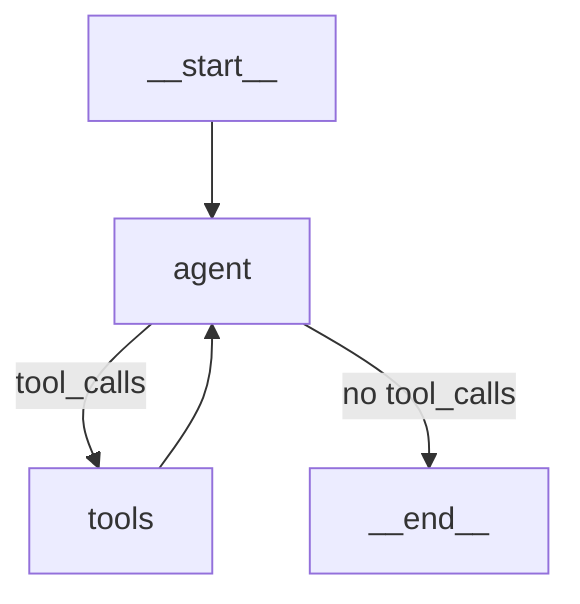

# create_react_agent vs Custom Graph

## Two Paths to the Same Pattern

LangGraph offers two ways to build a ReAct agent:

1. **`create_react_agent`** — Prebuilt function that creates a complete agent in one line
2. **Custom graph** — Build the graph yourself using `StateGraph`, nodes, and edges

Both produce the same ReAct pattern. The question is: when to use which?

```
┌─────────────────────────────────────────────────────────────────┐
│                                                                 │
│   create_react_agent              Custom Graph                  │
│   ──────────────────              ────────────                  │
│                                                                 │
│   • One function call             • Build from scratch          │
│   • Sensible defaults             • Full control                │
│   • Less code                     • More code                   │
│   • Limited customization         • Unlimited customization     │
│   • Good for prototypes           • Good for production         │
│   • Fast iteration                • Precise behavior            │
│                                                                 │
└─────────────────────────────────────────────────────────────────┘
```

---

## create_react_agent: The Quick Path

### Basic Usage

```python
from langgraph.prebuilt import create_react_agent
from langchain_openai import ChatOpenAI
from langchain_core.tools import tool

@tool
def calculator(expression: str) -> str:
    """Evaluate a math expression."""
    return str(eval(expression))

@tool
def get_weather(city: str) -> str:
    """Get weather for a city."""
    return f"Weather in {city}: 72°F, sunny"

tools = [calculator, get_weather]
llm = ChatOpenAI(model="gpt-4o-mini")

# One line creates a complete agent
agent = create_react_agent(llm, tools)

# Invoke
result = agent.invoke({
    "messages": [{"role": "user", "content": "What's 15% of 230?"}]
})
```

### With System Prompt

```python
agent = create_react_agent(
    llm,
    tools,
    prompt="You are a helpful assistant. Always explain your reasoning."
)
```

### With Checkpointer

```python
from langgraph.checkpoint.memory import MemorySaver

agent = create_react_agent(
    llm,
    tools,
    checkpointer=MemorySaver()
)

# Now you can use thread_id for persistence
config = {"configurable": {"thread_id": "session-1"}}
result = agent.invoke(input_state, config)
```

### Anthropic Version

```python
from langchain_anthropic import ChatAnthropic

llm = ChatAnthropic(model="claude-sonnet-4-20250514")

agent = create_react_agent(
    llm,
    tools,
    prompt="You are a helpful assistant.",
    checkpointer=MemorySaver()
)
```

**Note:** The function call is identical — only the LLM changes.

---

## create_react_agent Parameters

|Parameter|Type|Purpose|
|---|---|---|
|`model`|`ChatModel` or `str`|The LLM (can use model identifier string like `"openai:gpt-4o"`)|
|`tools`|`list[Tool]`|Tools available to the agent|
|`prompt`|`str` or `callable`|System prompt (string or function returning messages)|
|`checkpointer`|`BaseCheckpointSaver`|Enables persistence and memory|
|`interrupt_before`|`list[str]`|Pause before these nodes|
|`interrupt_after`|`list[str]`|Pause after these nodes|
|`pre_model_hook`|`callable`|Function to run before each LLM call|
|`post_model_hook`|`callable`|Function to run after each LLM call|
|`state_schema`|`type`|Custom state schema (extends default)|
|`debug`|`bool`|Enable debug logging|

### Example with More Parameters

```python
from langgraph.prebuilt import create_react_agent
from langgraph.checkpoint.memory import InMemorySaver

agent = create_react_agent(
    model="openai:gpt-4o-mini",  # Model identifier string
    tools=tools,
    prompt="You are a helpful assistant with access to tools.",
    checkpointer=InMemorySaver(),
    interrupt_before=["tools"],  # Human-in-the-loop before tool execution
    debug=True
)
```

---

## What create_react_agent Gives You

Under the hood, `create_react_agent` builds this graph:



It provides:

1. **Agent node** — Calls the LLM with tools bound
2. **Tools node** — Executes tools (uses `ToolNode` internally)
3. **Conditional routing** — Uses `tools_condition` to route based on tool calls
4. **Error handling** — `handle_tool_errors=True` by default
5. **MessagesState** — Prebuilt state with message reducer

---

## Custom Graph: The Precise Path

When you need control beyond what `create_react_agent` offers, build the graph yourself.

### Basic Custom Graph

```python
from langchain_openai import ChatOpenAI
from langchain_core.tools import tool
from langchain_core.messages import HumanMessage, SystemMessage
from langgraph.graph import StateGraph, MessagesState, START, END
from langgraph.prebuilt import ToolNode, tools_condition

# Tools
@tool
def calculator(expression: str) -> str:
    """Evaluate a math expression."""
    return str(eval(expression))

@tool
def get_weather(city: str) -> str:
    """Get weather for a city."""
    return f"Weather in {city}: 72°F, sunny"

tools = [calculator, get_weather]

# LLM with tools
llm = ChatOpenAI(model="gpt-4o-mini")
llm_with_tools = llm.bind_tools(tools)

# Agent node
def agent_node(state: MessagesState):
    system = SystemMessage(content="You are a helpful assistant.")
    messages = [system] + state["messages"]
    response = llm_with_tools.invoke(messages)
    return {"messages": [response]}

# Build graph
builder = StateGraph(MessagesState)
builder.add_node("agent", agent_node)
builder.add_node("tools", ToolNode(tools, handle_tool_errors=True))
builder.add_edge(START, "agent")
builder.add_conditional_edges("agent", tools_condition)
builder.add_edge("tools", "agent")

# Compile
graph = builder.compile()
```

### Equivalent Result, More Lines

The custom graph produces the **exact same behavior** as `create_react_agent`. So why bother?

Because custom graphs let you do things `create_react_agent` can't.

---

## When to Use Each

### Use create_react_agent When:

|Scenario|Why|
|---|---|
|**Prototyping**|Get something working in minutes|
|**Standard ReAct pattern**|No need to reinvent the wheel|
|**Simple tool-using agent**|Default behavior is exactly what you need|
|**Learning LangGraph**|Understand the pattern before customizing|
|**POCs and demos**|Minimize code, maximize speed|

### Use Custom Graph When:

|Scenario|Why|
|---|---|
|**Custom state fields**|Need more than just `messages`|
|**Custom routing logic**|Iteration limits, specialized conditions|
|**Multiple agent nodes**|Different LLMs for different tasks|
|**Preprocessing/postprocessing**|Add nodes before/after the main loop|
|**Non-standard flow**|Loops, branches, parallel execution|
|**Fine-grained error handling**|Custom recovery logic|
|**Custom tool execution**|Logging, validation, batching|
|**Production hardening**|Precise control over every behavior|

---

## Side-by-Side Comparison

### Simple Agent

**create_react_agent:**

```python
from langgraph.prebuilt import create_react_agent

agent = create_react_agent(llm, tools, prompt="You are helpful.")
```

**Custom Graph:**

```python
from langgraph.graph import StateGraph, MessagesState, START
from langgraph.prebuilt import ToolNode, tools_condition

def agent_node(state: MessagesState):
    response = llm_with_tools.invoke(state["messages"])
    return {"messages": [response]}

builder = StateGraph(MessagesState)
builder.add_node("agent", agent_node)
builder.add_node("tools", ToolNode(tools))
builder.add_edge(START, "agent")
builder.add_conditional_edges("agent", tools_condition)
builder.add_edge("tools", "agent")
graph = builder.compile()
```

**Verdict:** Use `create_react_agent` — same result, less code.

---

### Agent with Iteration Limit

**create_react_agent:**

```python
# Not directly supported — would need middleware or custom logic
```

**Custom Graph:**

```python
class AgentState(MessagesState):
    iteration_count: int

def agent_node(state: AgentState):
    response = llm_with_tools.invoke(state["messages"])
    return {
        "messages": [response],
        "iteration_count": state.get("iteration_count", 0) + 1
    }

def should_continue(state: AgentState) -> str:
    if state.get("iteration_count", 0) >= 5:
        return "max_iterations"
    last_message = state["messages"][-1]
    if hasattr(last_message, "tool_calls") and last_message.tool_calls:
        return "tools"
    return END

builder = StateGraph(AgentState)
builder.add_node("agent", agent_node)
builder.add_node("tools", ToolNode(tools))
builder.add_node("summarize", summarize_node)  # Handle max iterations
builder.add_edge(START, "agent")
builder.add_conditional_edges("agent", should_continue, {
    "tools": "tools",
    "max_iterations": "summarize",
    END: END
})
builder.add_edge("tools", "agent")
builder.add_edge("summarize", END)
```

**Verdict:** Use custom graph — needs custom state and routing.

---

### Agent with Preprocessing

**create_react_agent:**

```python
# Limited support via pre_model_hook
agent = create_react_agent(
    llm,
    tools,
    pre_model_hook=my_preprocessing_function
)
```

**Custom Graph:**

```python
def preprocess_node(state: MessagesState):
    # Add context, validate input, inject user preferences
    return {"messages": state["messages"]}

def agent_node(state: MessagesState):
    response = llm_with_tools.invoke(state["messages"])
    return {"messages": [response]}

builder = StateGraph(MessagesState)
builder.add_node("preprocess", preprocess_node)
builder.add_node("agent", agent_node)
builder.add_node("tools", ToolNode(tools))
builder.add_edge(START, "preprocess")
builder.add_edge("preprocess", "agent")
builder.add_conditional_edges("agent", tools_condition)
builder.add_edge("tools", "agent")
```

**Verdict:** Depends on complexity. Simple preprocessing → `pre_model_hook`. Complex preprocessing → custom graph.

---

### Agent with Multiple LLMs

**create_react_agent:**

```python
# Not supported — single model only
```

**Custom Graph:**

```python
from langchain_openai import ChatOpenAI
from langchain_anthropic import ChatAnthropic

fast_llm = ChatOpenAI(model="gpt-4o-mini").bind_tools(tools)
smart_llm = ChatAnthropic(model="claude-sonnet-4-20250514").bind_tools(tools)

def route_to_llm(state: MessagesState) -> str:
    # Use fast LLM for simple queries, smart LLM for complex ones
    last_msg = state["messages"][-1].content
    if len(last_msg) < 50:
        return "fast_agent"
    return "smart_agent"

def fast_agent(state: MessagesState):
    return {"messages": [fast_llm.invoke(state["messages"])]}

def smart_agent(state: MessagesState):
    return {"messages": [smart_llm.invoke(state["messages"])]}

builder = StateGraph(MessagesState)
builder.add_node("fast_agent", fast_agent)
builder.add_node("smart_agent", smart_agent)
builder.add_node("tools", ToolNode(tools))
builder.add_conditional_edges(START, route_to_llm)
# ... rest of routing logic
```

**Verdict:** Use custom graph — multiple LLMs require custom nodes.

---

## The Migration Path

A common pattern:

```
1. Start with create_react_agent (prototype)
   ↓
2. Hit a limitation
   ↓
3. Migrate to custom graph (production)
```

### Migration Example

**Before (create_react_agent):**

```python
agent = create_react_agent(
    llm,
    tools,
    prompt="You are helpful.",
    checkpointer=MemorySaver()
)
```

**After (Custom Graph):**

```python
def agent_node(state: MessagesState):
    system = SystemMessage(content="You are helpful.")
    messages = [system] + state["messages"]
    response = llm_with_tools.invoke(messages)
    return {"messages": [response]}

builder = StateGraph(MessagesState)
builder.add_node("agent", agent_node)
builder.add_node("tools", ToolNode(tools, handle_tool_errors=True))
builder.add_edge(START, "agent")
builder.add_conditional_edges("agent", tools_condition)
builder.add_edge("tools", "agent")

graph = builder.compile(checkpointer=MemorySaver())
```

The migration is straightforward because `create_react_agent` is just a convenience wrapper around the same primitives.

---

## What create_react_agent Cannot Do

|Limitation|Alternative|
|---|---|
|**Custom state fields**|Use custom graph with extended state|
|**Multiple agent nodes**|Use custom graph with multiple LLM nodes|
|**Non-ReAct patterns**|Use custom graph (plan-and-execute, etc.)|
|**Complex routing**|Use custom graph with custom conditional edges|
|**Parallel tool execution control**|Use custom ToolNode configuration|
|**Tool result validation**|Use custom graph with validation node|
|**Dynamic tool selection**|Use middleware or custom graph|
|**Sub-graphs**|Use custom graph with nested graphs|

---

## Important Note: API Changes

**As of late 2025**, the import location has changed:

```python
# OLD (deprecated but still works)
from langgraph.prebuilt import create_react_agent

# NEW (recommended)
from langchain.agents import create_react_agent
# or
from langchain.agents import create_agent  # More general name
```

The functionality is the same. The move to `langchain.agents` reflects that agents are a LangChain concept built on LangGraph infrastructure.

**For this course**, either import works. The patterns and concepts are identical.

---

## Decision Framework

```
┌─────────────────────────────────────────────────────────────────┐
│                                                                 │
│   START                                                         │
│     │                                                           │
│     ▼                                                           │
│   Is this a standard ReAct pattern?                             │
│     │                                                           │
│     ├─── YES ──▶ Is it a prototype/POC?                         │
│     │              │                                            │
│     │              ├─── YES ──▶ create_react_agent              │
│     │              │                                            │
│     │              └─── NO ──▶ Do you need custom state?        │
│     │                           │                               │
│     │                           ├─── NO ──▶ create_react_agent  │
│     │                           │                               │
│     │                           └─── YES ──▶ Custom Graph       │
│     │                                                           │
│     └─── NO ──▶ Custom Graph                                    │
│                                                                 │
└─────────────────────────────────────────────────────────────────┘
```

---

## Quick Reference

### create_react_agent

```python
from langgraph.prebuilt import create_react_agent
from langgraph.checkpoint.memory import MemorySaver

agent = create_react_agent(
    model=llm,           # or "openai:gpt-4o"
    tools=tools,
    prompt="System prompt",
    checkpointer=MemorySaver(),
    interrupt_before=["tools"],  # Optional HITL
)

result = agent.invoke(
    {"messages": [{"role": "user", "content": "query"}]},
    config={"configurable": {"thread_id": "1"}}
)
```

### Custom Graph

```python
from langgraph.graph import StateGraph, MessagesState, START
from langgraph.prebuilt import ToolNode, tools_condition
from langgraph.checkpoint.memory import MemorySaver

def agent_node(state: MessagesState):
    return {"messages": [llm_with_tools.invoke(state["messages"])]}

builder = StateGraph(MessagesState)
builder.add_node("agent", agent_node)
builder.add_node("tools", ToolNode(tools, handle_tool_errors=True))
builder.add_edge(START, "agent")
builder.add_conditional_edges("agent", tools_condition)
builder.add_edge("tools", "agent")

graph = builder.compile(checkpointer=MemorySaver())
```

---

## Key Takeaways

1. **`create_react_agent` is a convenience wrapper** — it builds the same graph you'd build manually
    
2. **Start with `create_react_agent`** for prototypes and standard use cases
    
3. **Migrate to custom graph** when you hit limitations (custom state, routing, multiple LLMs)
    
4. **The migration is straightforward** — same primitives, just assembled manually
    
5. **Custom graphs unlock:** iteration limits, preprocessing, multiple LLMs, non-ReAct patterns, fine-grained control
    
6. **Both approaches are provider-agnostic** — swap LLMs without changing structure
    
7. **Learning both is valuable** — understanding the custom graph helps you understand what `create_react_agent` does
    

---

## References

- [LangChain Agents Documentation](https://docs.langchain.com/oss/python/langchain/agents) — Official create_agent docs
- [LangGraph Prebuilt PyPI](https://pypi.org/project/langgraph-prebuilt/) — Package documentation
- [LangGraph GitHub react-agent template](https://github.com/langchain-ai/react-agent) — Official template
- [create_react_agent API Reference](https://python.langchain.com/api_reference/langchain/agents/langchain.agents.react.agent.create_react_agent.html) — Full parameter list