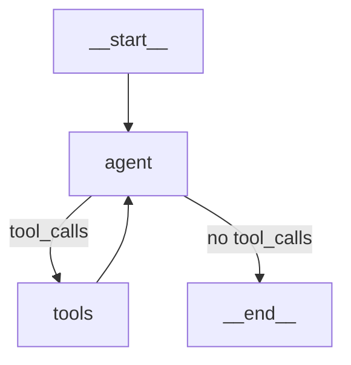

# Debugging and Observability in LangGraph

## Why This Matters

When your agent loops forever, calls the wrong tool, or produces garbage output, you need to see what happened. Unlike a raw `while` loop where you'd sprinkle `print()` statements, LangGraph provides structured ways to observe execution without modifying your business logic.

---

## Three Debugging Approaches

|Approach|Effort|Detail Level|Use Case|
|---|---|---|---|
|**Streaming modes**|Low|Medium|See node execution in real-time|
|**Custom callbacks**|Medium|High|Custom logging, metrics, alerts|
|**Print in nodes**|Low|Low|Quick debugging (remove later)|

---

## Approach 1: Streaming Modes

Instead of `invoke()`, use `stream()` with different modes to observe execution.

### stream_mode="updates"

Shows state changes after each node. Most useful for debugging.

```python
from langgraph.graph import StateGraph, MessagesState, START
from langgraph.prebuilt import ToolNode, tools_condition

# ... build your graph ...
graph = builder.compile()

# Stream updates
for chunk in graph.stream(
    {"messages": [{"role": "user", "content": "What's 2+2?"}]},
    stream_mode="updates"
):
    # chunk is {node_name: state_update}
    for node_name, update in chunk.items():
        print(f"Node '{node_name}' returned: {update}")
```

**Output:**

```
Node 'agent' returned: {'messages': [AIMessage(content='', tool_calls=[...])]}
Node 'tools' returned: {'messages': [ToolMessage(content='4', ...)]}
Node 'agent' returned: {'messages': [AIMessage(content='2+2 equals 4')]}
```

### stream_mode="values"

Shows complete state after each node. More data, but useful when you need full context.

```python
for chunk in graph.stream(
    {"messages": [{"role": "user", "content": "What's 2+2?"}]},
    stream_mode="values"
):
    # chunk is the FULL state after each node
    print(f"State now has {len(chunk['messages'])} messages")
    print(f"Last message: {chunk['messages'][-1]}")
    print("---")
```

### stream_mode="debug"

Maximum information — includes checkpoints, tasks, metadata. Verbose but comprehensive.

```python
for chunk in graph.stream(
    {"messages": [{"role": "user", "content": "What's 2+2?"}]},
    stream_mode="debug"
):
    print(chunk)  # Lots of data
```

**Best for:** Deep debugging when you can't figure out what's happening.

### Combining Modes

```python
for chunk in graph.stream(
    inputs,
    stream_mode=["updates", "messages"],
    version="v2"  # Required for multi-mode
):
    if chunk["type"] == "updates":
        for node_name, state in chunk["data"].items():
            print(f"✓ {node_name} completed")
    elif chunk["type"] == "messages":
        msg, metadata = chunk["data"]
        print(msg.content, end="", flush=True)  # Stream LLM tokens
```

---

## Streaming Mode Reference

|Mode|What It Shows|When to Use|
|---|---|---|
|`values`|Full state after each node|Need complete context|
|`updates`|Only changed state keys|Track progress, less verbose|
|`messages`|LLM tokens + metadata|Chat UIs, real-time response|
|`debug`|Everything (checkpoints, tasks, metadata)|Deep debugging|
|`custom`|Your custom data via `get_stream_writer()`|Progress bars, custom metrics|

---

## Approach 2: Custom Callbacks

LangGraph uses LangChain's callback system. You can hook into execution without modifying node code.

### Basic Callback Handler

```python
from langchain_core.callbacks import BaseCallbackHandler

class DebugCallbackHandler(BaseCallbackHandler):
    """Print every chain start/end."""
    
    def on_chain_start(self, serialized, inputs, **kwargs):
        name = serialized.get("name", "unknown")
        print(f"▶ Starting: {name}")
        print(f"  Input keys: {list(inputs.keys()) if isinstance(inputs, dict) else type(inputs)}")
    
    def on_chain_end(self, outputs, **kwargs):
        print(f"◀ Finished")
        if isinstance(outputs, dict):
            print(f"  Output keys: {list(outputs.keys())}")
    
    def on_chain_error(self, error, **kwargs):
        print(f"✗ Error: {error}")

# Use with invoke
result = graph.invoke(
    {"messages": [{"role": "user", "content": "Hello"}]},
    config={"callbacks": [DebugCallbackHandler()]}
)
```

### Callback for LLM Calls

```python
class LLMDebugHandler(BaseCallbackHandler):
    """Track LLM calls specifically."""
    
    def on_llm_start(self, serialized, prompts, **kwargs):
        print(f"🤖 LLM called with {len(prompts)} prompt(s)")
    
    def on_llm_end(self, response, **kwargs):
        # response.generations contains the output
        print(f"🤖 LLM finished")
        if hasattr(response, 'llm_output') and response.llm_output:
            usage = response.llm_output.get('token_usage', {})
            if usage:
                print(f"   Tokens: {usage}")
    
    def on_tool_start(self, serialized, input_str, **kwargs):
        name = serialized.get("name", "unknown")
        print(f"🔧 Tool '{name}' called")
    
    def on_tool_end(self, output, **kwargs):
        print(f"🔧 Tool returned: {output[:100]}..." if len(str(output)) > 100 else f"🔧 Tool returned: {output}")
```

### Attaching Callbacks

**Option 1: Per invocation**

```python
result = graph.invoke(inputs, config={"callbacks": [MyHandler()]})
```

**Option 2: Baked into compiled graph**

```python
graph = builder.compile()
graph_with_callbacks = graph.with_config({"callbacks": [MyHandler()]})

# Now every invocation uses the callbacks
result = graph_with_callbacks.invoke(inputs)
```

---

## Approach 3: Print in Nodes (Quick and Dirty)

Sometimes you just need a quick look. Add prints directly in your nodes.

```python
def agent_node(state: MessagesState):
    print(f"[AGENT] Received {len(state['messages'])} messages")
    print(f"[AGENT] Last message: {state['messages'][-1].content[:100]}")
    
    response = llm_with_tools.invoke(state["messages"])
    
    print(f"[AGENT] Response type: {type(response)}")
    print(f"[AGENT] Tool calls: {len(response.tool_calls) if response.tool_calls else 0}")
    
    return {"messages": [response]}
```

**Pros:** Fast, no setup **Cons:** Pollutes business logic, must remove later

---

## Visualizing the Graph

LangGraph can render your graph structure:

```python
from IPython.display import Image, display

# Compile first
graph = builder.compile()

# Render as PNG (requires graphviz)
display(Image(graph.get_graph().draw_mermaid_png()))
```

Or get Mermaid syntax for documentation:

```python
print(graph.get_graph().draw_mermaid())
```

**Output:**



---

## Debugging Common Issues

### Issue: Agent Loops Forever

**Symptom:** Graph never reaches END, hits recursion_limit

**Debug with streaming:**

```python
for i, chunk in enumerate(graph.stream(inputs, stream_mode="updates")):
    print(f"Step {i}: {list(chunk.keys())}")
    if i > 20:
        print("Too many iterations, stopping")
        break
```

**Look for:** Same node repeating, tool returning errors that LLM keeps retrying

### Issue: Wrong Tool Called

**Debug with callback:**

```python
class ToolTracker(BaseCallbackHandler):
    def on_tool_start(self, serialized, input_str, **kwargs):
        print(f"Tool: {serialized.get('name')}")
        print(f"Args: {input_str}")
```

**Look for:** Incorrect tool names, malformed arguments

### Issue: State Not Updating

**Debug with streaming values:**

```python
for chunk in graph.stream(inputs, stream_mode="values"):
    print(f"Messages count: {len(chunk['messages'])}")
    # Check if your custom state fields are updating
    if "my_field" in chunk:
        print(f"my_field: {chunk['my_field']}")
```

**Look for:** Missing reducer, node not returning expected keys

### Issue: Tool Errors Not Visible

**Check ToolNode config:**

```python
# If handle_tool_errors=False (default post-1.0.1), errors crash the graph
# Enable to see errors in message stream:
tool_node = ToolNode(tools, handle_tool_errors=True)
```

---

## Quick Debugging Checklist

```
□ Use stream_mode="updates" to see node-by-node execution
□ Check graph visualization matches expected flow
□ Verify tool names in LLM output match registered tools
□ Confirm state schema has reducers for parallel updates
□ Check handle_tool_errors=True if tools might fail
□ Look at recursion_limit if graph runs too long
□ Add callback handler for LLM/tool tracking
```

---

## Example: Full Debug Setup

```python
from langchain_openai import ChatOpenAI
from langchain_core.tools import tool
from langchain_core.callbacks import BaseCallbackHandler
from langgraph.graph import StateGraph, MessagesState, START
from langgraph.prebuilt import ToolNode, tools_condition

# Debug callback
class DebugHandler(BaseCallbackHandler):
    def on_chain_start(self, serialized, inputs, **kwargs):
        print(f"▶ {serialized.get('name', '?')}")
    
    def on_tool_start(self, serialized, input_str, **kwargs):
        print(f"  🔧 {serialized.get('name')}: {input_str[:50]}")
    
    def on_tool_end(self, output, **kwargs):
        print(f"  🔧 → {str(output)[:50]}")

# Tools
@tool
def add(a: int, b: int) -> int:
    """Add two numbers."""
    return a + b

tools = [add]
llm = ChatOpenAI(model="gpt-4o-mini").bind_tools(tools)

# Agent node
def agent_node(state: MessagesState):
    return {"messages": [llm.invoke(state["messages"])]}

# Build graph
builder = StateGraph(MessagesState)
builder.add_node("agent", agent_node)
builder.add_node("tools", ToolNode(tools, handle_tool_errors=True))
builder.add_edge(START, "agent")
builder.add_conditional_edges("agent", tools_condition)
builder.add_edge("tools", "agent")

graph = builder.compile()

# Run with debugging
print("=== Streaming Updates ===")
for chunk in graph.stream(
    {"messages": [{"role": "user", "content": "What's 5 + 3?"}]},
    stream_mode="updates",
    config={"callbacks": [DebugHandler()]}
):
    for node, update in chunk.items():
        msg = update["messages"][-1]
        print(f"  [{node}] {type(msg).__name__}: {str(msg.content)[:50] or '[tool call]'}")
```

**Sample Output:**

```
=== Streaming Updates ===
▶ agent
  [agent] AIMessage: [tool call]
  🔧 add: {"a": 5, "b": 3}
  🔧 → 8
  [tools] ToolMessage: 8
▶ agent
  [agent] AIMessage: 5 + 3 equals 8.
```

---

## What's NOT Covered Here

This note covers debugging tools available within LangGraph itself. For production observability (dashboards, trace storage, cost tracking), you'll use external tools in Week 8:

- **LangSmith** — Full tracing, evals, debugging UI
- **Langfuse** — Open-source alternative
- **Custom OpenTelemetry** — For existing observability stacks

Those integrate via the same callback system shown here, but with persistent storage and UIs.

---

## Key Takeaways

1. **`stream_mode="updates"`** is your primary debugging tool — shows each node's output
    
2. **Callbacks hook into execution** without modifying node code — use for logging, metrics
    
3. **Visualize your graph** to verify structure matches intent
    
4. **Combine approaches:** streaming for flow, callbacks for details, prints for quick checks
    
5. **Check `handle_tool_errors`** — hidden errors cause mysterious behavior
    
6. **Don't guess, observe:** streaming costs nothing and shows exactly what's happening
    

---

## References

- [LangGraph Streaming Documentation](https://docs.langchain.com/oss/python/langgraph/streaming) — Official streaming guide
- [LangChain Callbacks](https://python.langchain.com/docs/concepts/callbacks/) — Callback system documentation
- [LangGraph Troubleshooting Cheatsheet](https://sumanmichael.github.io/langgraph-cheatsheet/cheatsheet/troubleshooting-debugging/) — Common issues and fixes